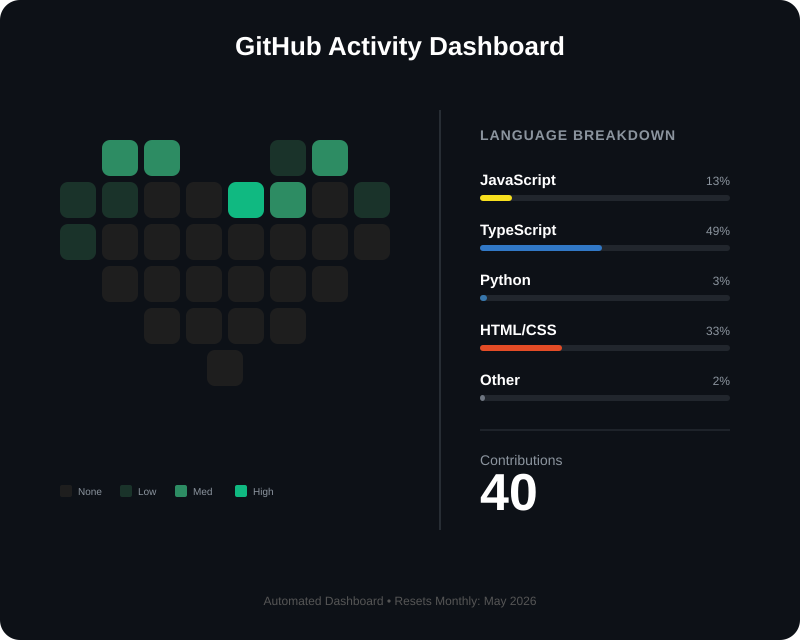

# GitHub Activity Heart Dashboard

A seasonal SVG dashboard that visualizes your monthly GitHub contributions and language breakdown in a heart-shaped grid.

## Features

- **31-day heart grid**: Each day colored by contribution intensity (empty → low → medium → high)
- **Seasonal theming**: Colors shift based on current season (🌱 Spring green, ☀️ Summer amber, 🍂 Autumn orange, ❄️ Winter blue)
- **Language breakdown**: Tracks JavaScript, TypeScript, Python, HTML/CSS + aggregates others
- **Fully automated**: GitHub Actions updates daily via cron job

## Setup

1. Add secrets to your repo:
   - `GH_TOKEN`: GitHub personal access token
   - `GH_USERNAME`: Your GitHub username

2. Create `.github/workflows/main.yml`:


3. Create `src/template.svg` with placeholders:
   - `id="day_1"` through `id="day_31"` (fill color updates)
   - `id="lang_1_name"`, `id="lang_1_percent"`, `id="lang_1_bar"` (same for 2-5)
   - `id="total_count"` (total contributions)
   - `id="footer_text"` (month label)

4. Embed in your README:
```html

```

## How It Works

- Fetches current month data via GitHub GraphQL API
- Maps 31 daily contribution counts to color intensities
- Calculates language percentages (Largest Remainder rounding)
- Updates SVG template with dynamic values
- Commits and pushes updated `heart.svg`

## Stack

- Python 3.9+
- GitHub GraphQL API v4
- SVG + regex templating
- GitHub Actions (cron-scheduled)